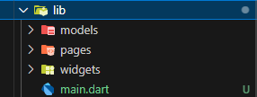
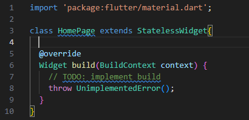
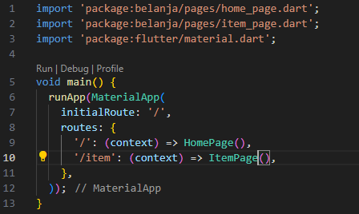
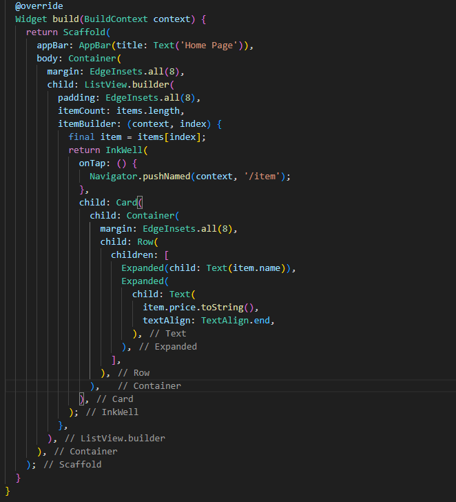
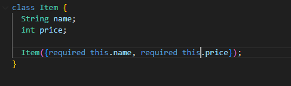

# LAYOUT DAN NAVIGASI

Laporan Praktikum Pertemuan 4

modul   
https://jti-polinema.github.io/flutter-codelab/06-layout-navigasi/#0

## Praktikum 5 - Membangun Navigasi di Flutter

## Hasil Akhir

## TUGAS PRAKTIKUM 5 - NAVIGASI DENGAN DATA
