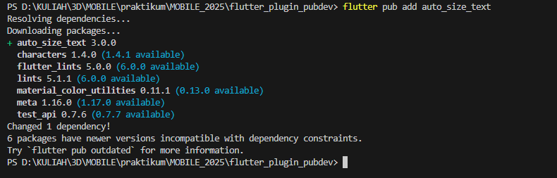
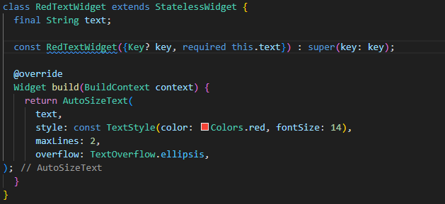
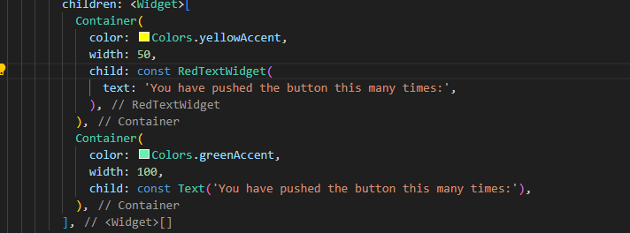
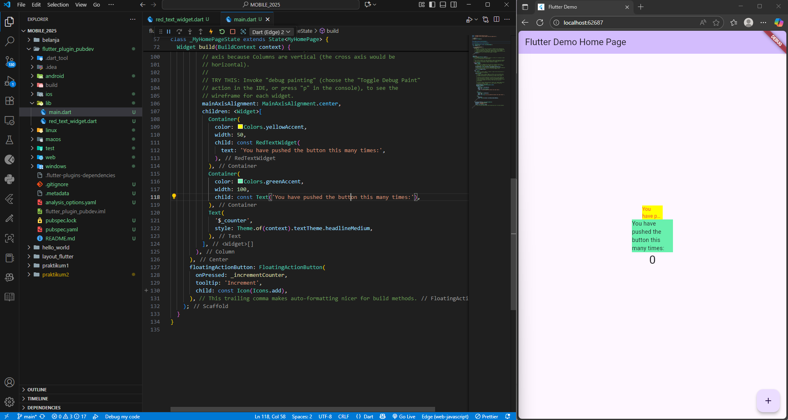

# Praktikum 5 - Management Plugin

## Modul
https://jti-polinema.github.io/flutter-codelab/07-manajemen-plugin/#0

## Menambah Plugin

## membuat widget text red

## Membuat Widget di Main.dart

## Hasil Akhir
