# BASIC WIDGET HELLO WORLD

Laporan Praktikum Pertemuan 3 

modul   
https://jti-polinema.github.io/flutter-codelab/05-first-app-widget-dasar-flutter/#0

## Praktikum 1 - Membuat Project Flutter Baru

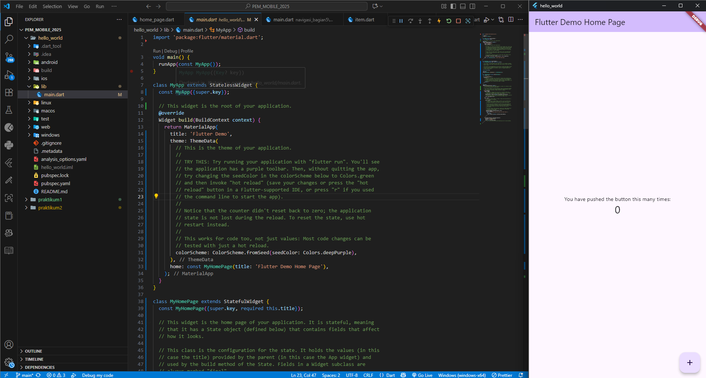

## Praktikum 2 - Menghubungkan perangkat android atau emulator

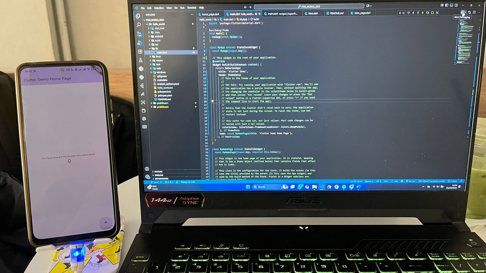

## Praktikum 3 - Membuat Repository Github dan Laporan Praktikum

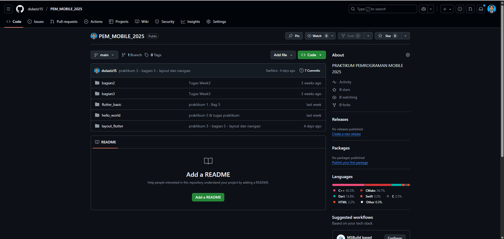

## Praktikum 4 - Menerapkan Widget Dasar

- TextWIdget
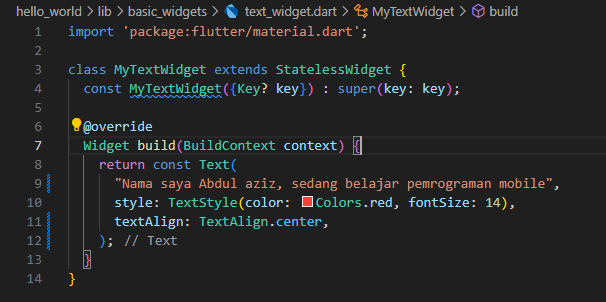
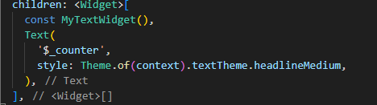
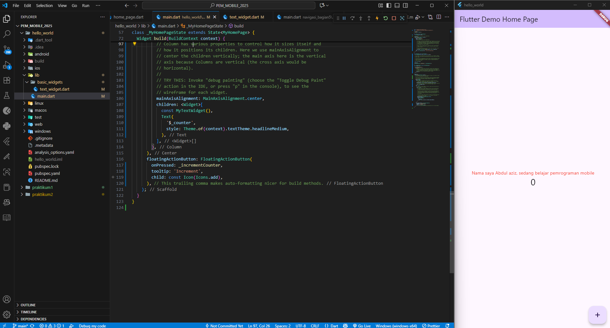

- ImageWidget
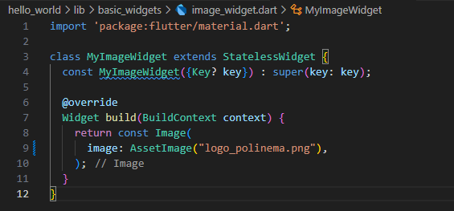
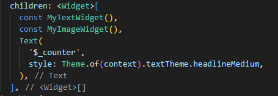
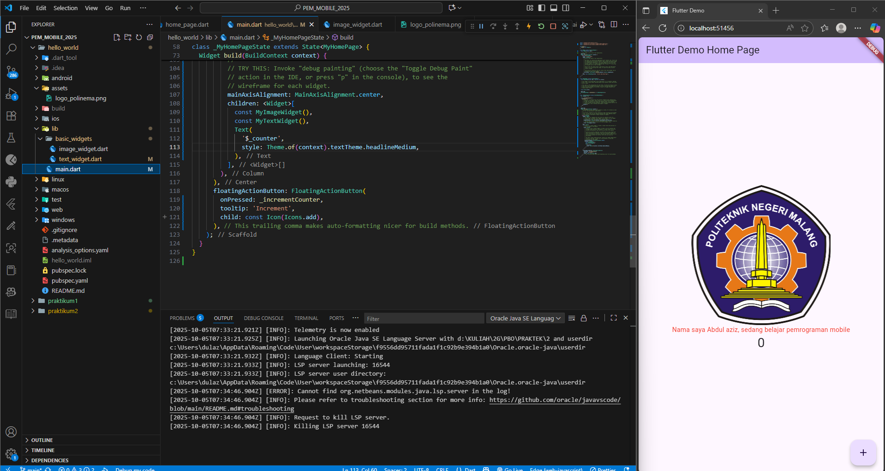

## Praktikum 5 - Menerapkan Widget Material Design dan IOS Cupertino

- Loading Cupertino
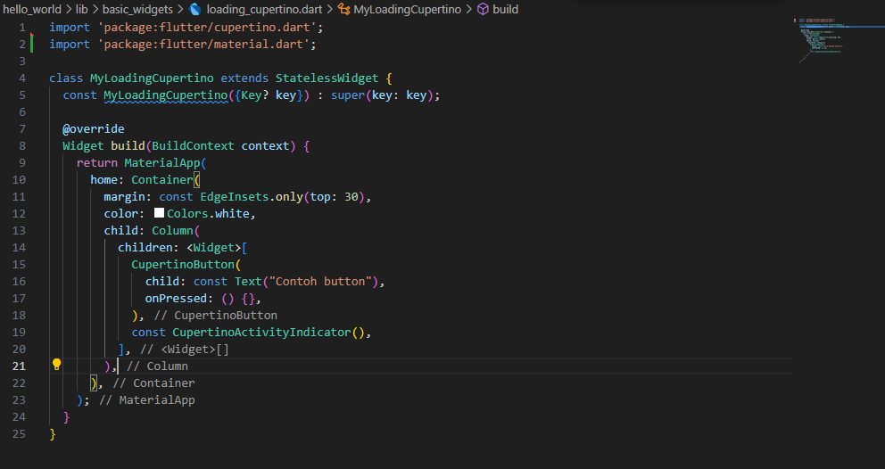
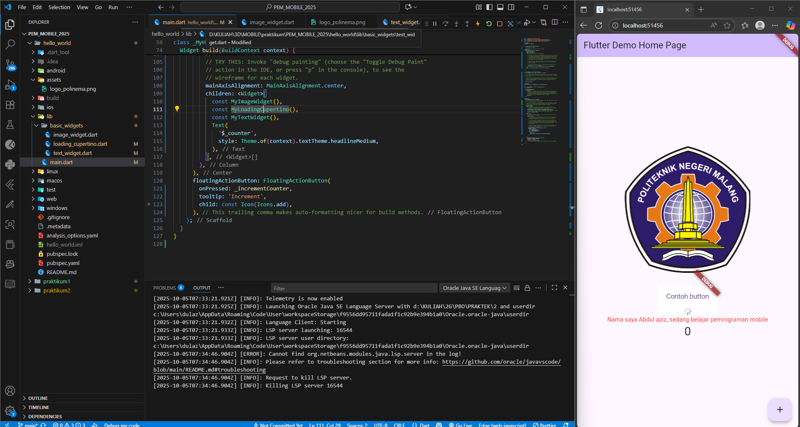

- Floating Button Action
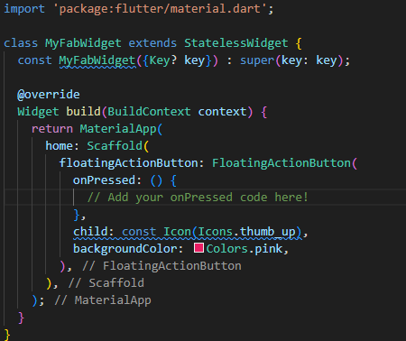

- Scaffold Widget
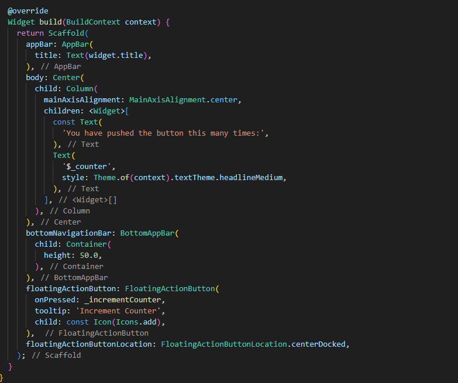
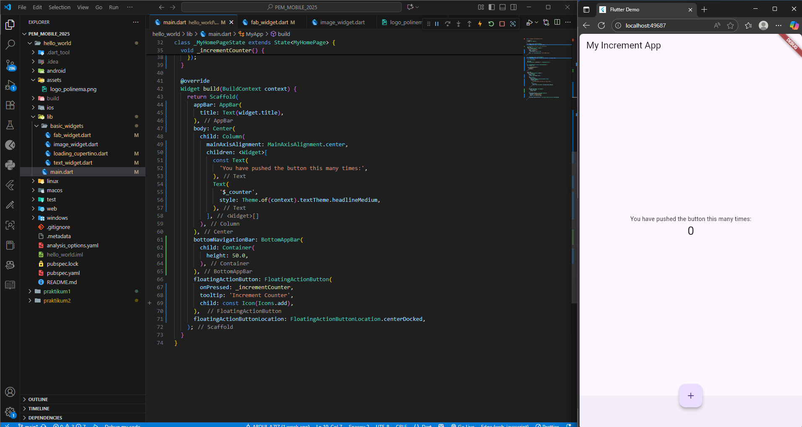

- Dialog Widget
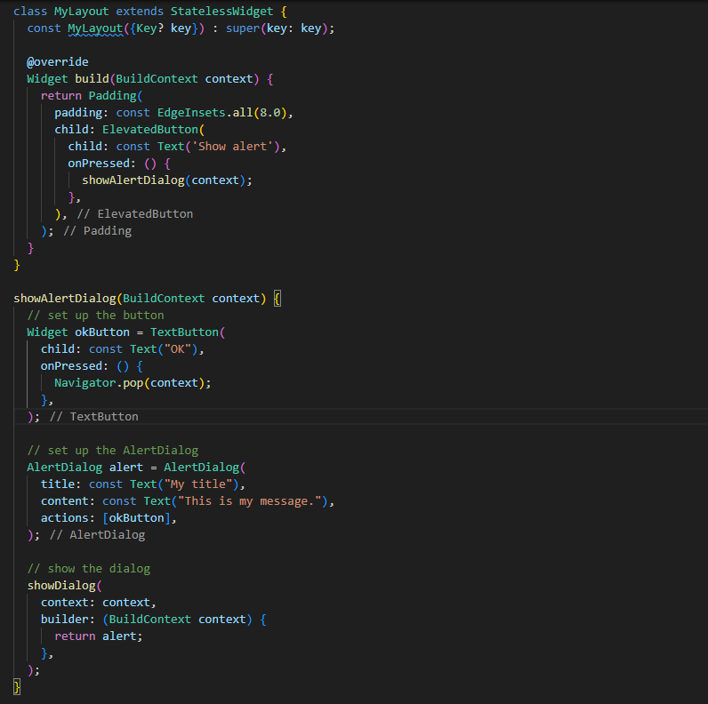

- Input dan Selection Widget
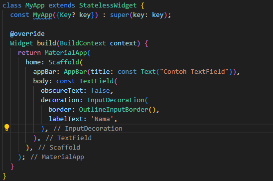

- Date Time Picker
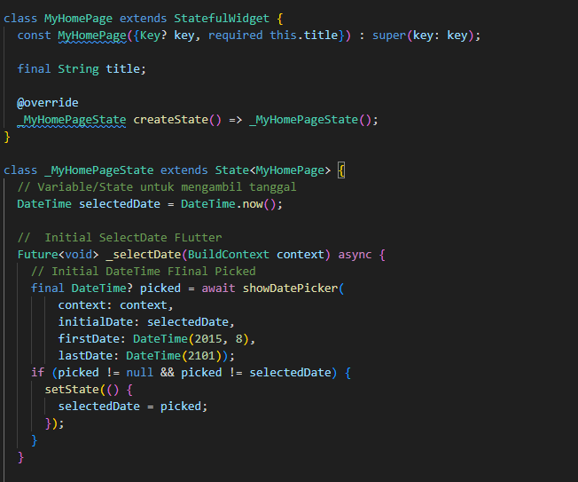

# TUGAS PRAKTIKUM
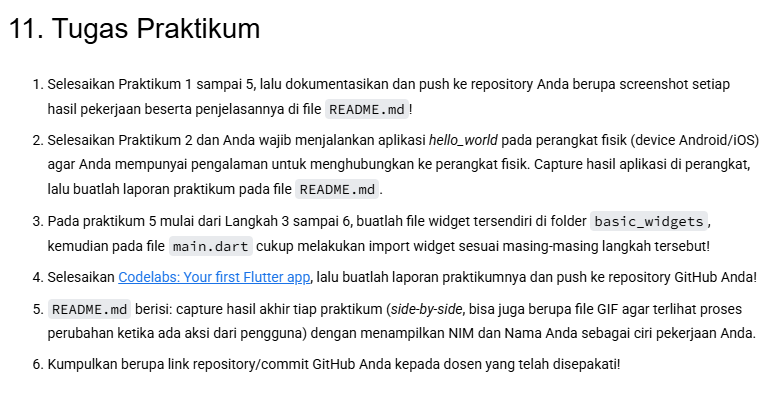

## Pecah Widget

- Scaffold Widget
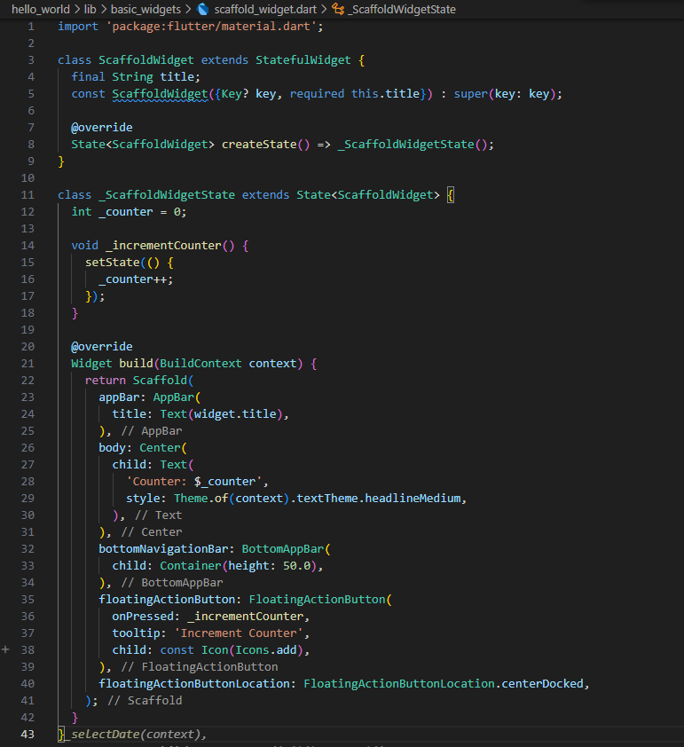
- Dialog Widget
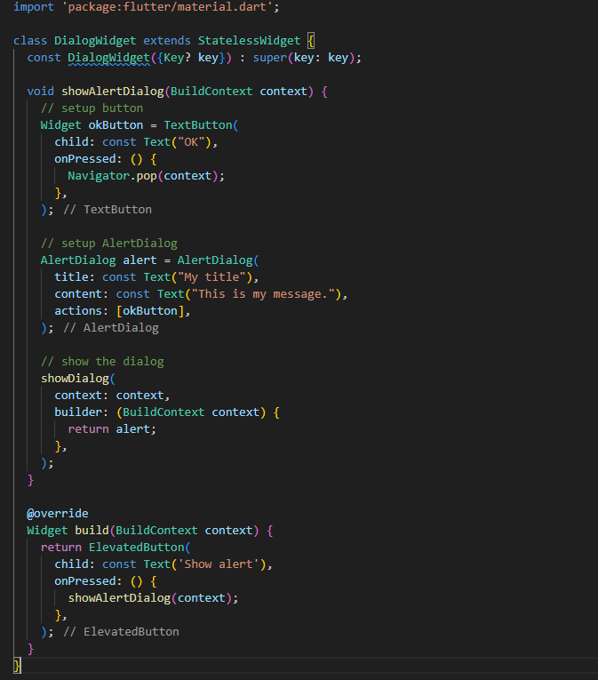
- Input Selection
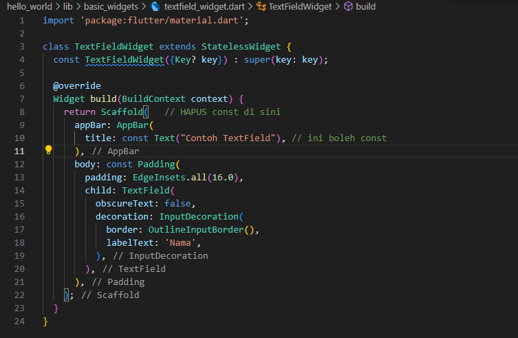
- Date Picker
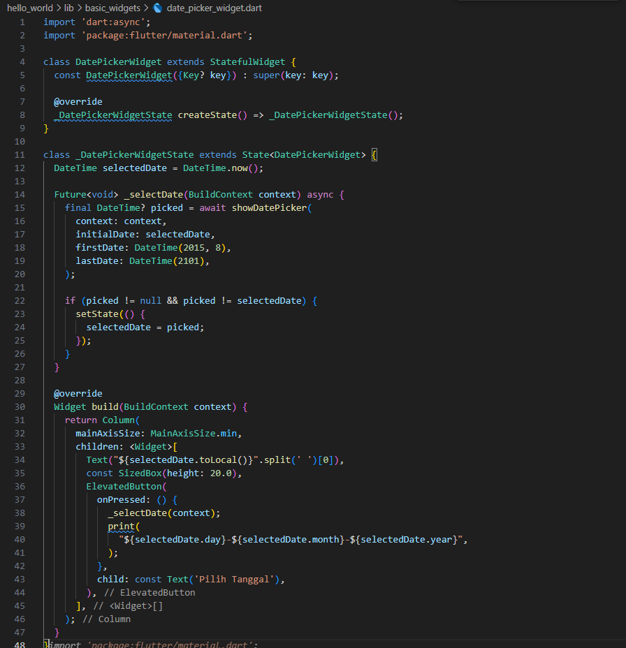

## Menggabungkan Widget
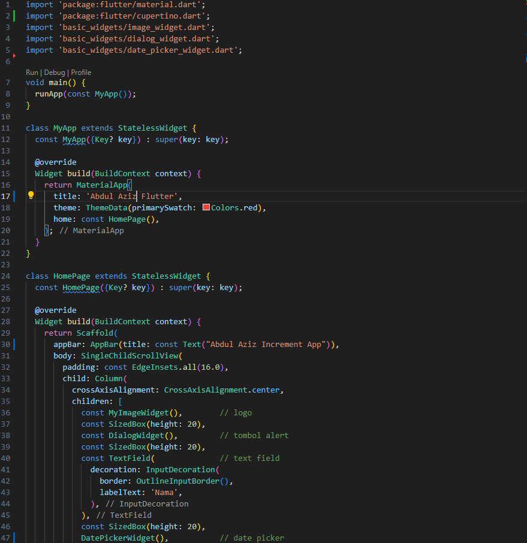
