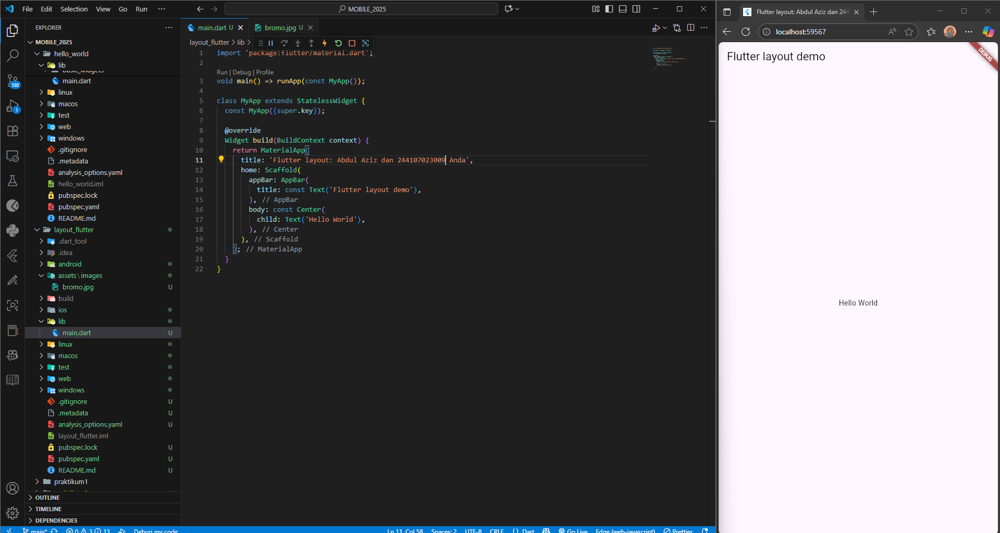
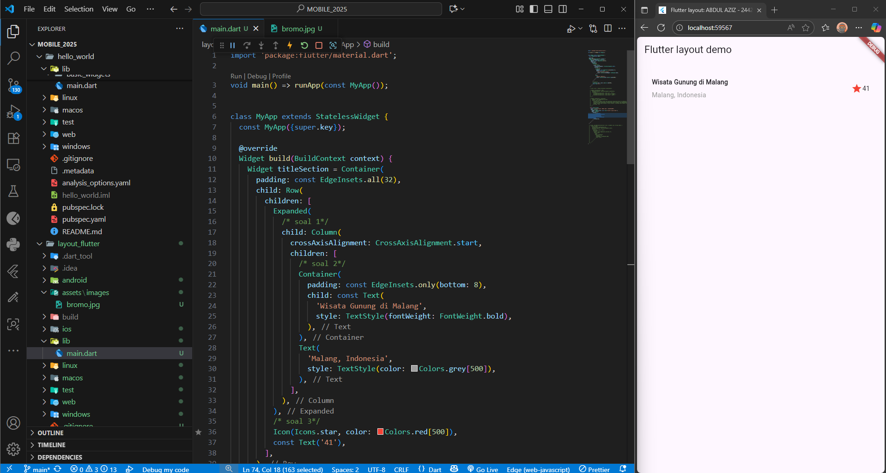
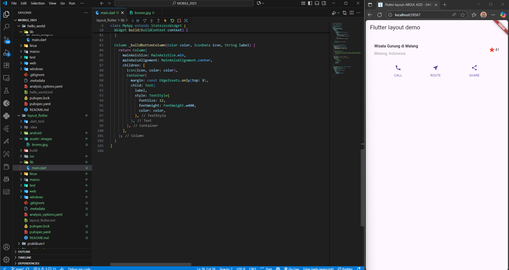
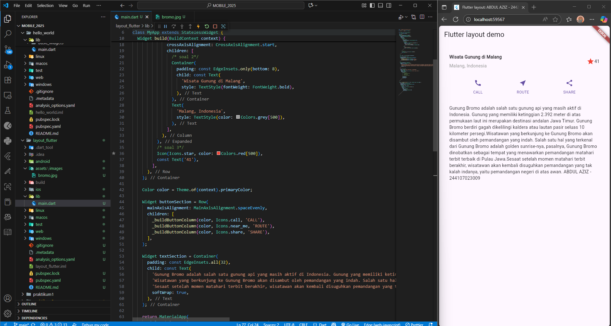
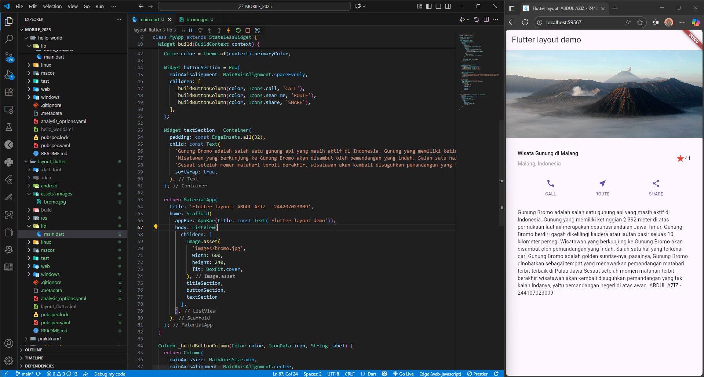

# LAYOUT DAN NAVIGASI

Laporan Praktikum Pertemuan 4

modul   
https://jti-polinema.github.io/flutter-codelab/06-layout-navigasi/#0

## Praktikum 1 - Membangun Layout di Flutter

## Praktikum 2 - Implementasi Button Row

## Praktikum 3 - Implementasi Text Section

## Praktikum 4 - Implementasi Image Section

## Praktikum 5 - Membangun Navigasi di Flutter
